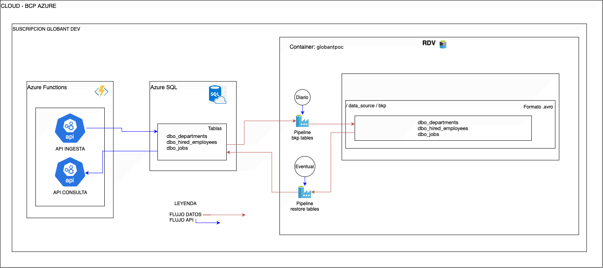

# 🌟 **Big Data Migration Project** 🌟

## 📖 **Project Description**

This project aims to perform the **migration of historical data** from **CSV** files to a new **SQL** database system. Additionally, a **RESTful API** service is created to receive new data, following a predefined set of rules. This project also includes **backup** and **data restoration** functionalities.


### 🔑 **Main Features**

1. **📦 Data Migration (CSV to Database)**:
   - Historical data from **CSV** files is migrated to a new **SQL** database.
   - All fields are **mandatory**.
   - Records that do not comply with the data rules should not be inserted but should be logged in an **error table*

2. **🔌 RESTful API**:
   - A **REST API** to receive new data, with the following features:
     - Each new transaction must comply with the data dictionary rules.
     - Support for batch transactions of up to **1000 rows** per request.
     - Data for all tables is received in the same service.
     - All data rules for the tables are taken into account.
     - The **API** must receive `POST` requests with data in **JSON** format.
     - The **API** must verify that each transaction complies with the data dictionary rules.
     - The affected tables by the **API** include:
        - `hired_employees`: Information about the hired employees.
        - `departments`: Information about departments.
        - `jobs`: Information about jobs.
3. **💾 Data Backup**:
   - Functionality to back up the data from each table and save it in the file system in **AVRO** format.

4. **🔄 Data Restoration**:
   - Functionality to restore a specific table from its backup.

### 🗂️ **File Structure
	•	api_azurefunctions/: Code for the RESTful API.
	•	ddls/: Scripts to create tables and DML procedures.


### 🏗️  **Architecture**



Proof of Functionality

Load Files in ADLS Main
ADLS Gen2 is deployed to store CSV files.
    - RV: Raw Vault
	- DV: Dimensional Vault

ADLS Backup
ADLS Gen2 is deployed for backup files and tables’ data. It uses a paired region from the main one.
	•	Another approach would be to use the read-access geo-zone concept, depending on cost and complexity.

Azure SQL Database
	•	Dedicated SQL Pool is deployed to query data.
	•	There are two types of tables:
	•	Main: For principal data.
	•	Backup: For restore operations.

Azure Data Factory
Azure Data Factory is used to move data from RV to UV or DV, depending on the data’s origin.
	•	It is also required to execute Databricks notebooks.
	•	There are two pipelines:
	•	One for ETL operations for the main tables.
	•	The second for backup processes.

Azure Databricks
Databricks notebooks are used for data transformation and loading into another path, such as UV or DV.

Azure App Services for API Solution
App Services are used to mount the function_app.py script:
	•	function_app.py runs .


## 📋 **Installation and Setup**

### Clone the Repository

```bash
git clone https://github.com/marioych/globant-dev.git
cd globant-dev