# 🌟 **Big Data Migration Project** 🌟

## 📖 **Project Description**

This project aims to perform the **migration of historical data** from **CSV** files to a new **SQL** database system. Additionally, a **RESTful API** service is created to receive new data, following a predefined set of rules. This project also includes **backup** and **data restoration** functionalities.


### 🔑 **Main Features**

1. **📦 Data Migration (CSV to Database)**:
   - Historical data from **CSV** files is migrated to a new **SQL** database.
   - All fields are **mandatory**.
   - Records that do not comply with the data rules should not be inserted but should be logged in an **error table*

2. **🔌 RESTful API**:
   - A **REST API** to receive new data, with the following features:
     - Each new transaction must comply with the data dictionary rules.
     - Support for batch transactions of up to **1000 rows** per request.
     - Data for all tables is received in the same service.
     - All data rules for the tables are taken into account.
     - The **API** must receive `POST` requests with data in **JSON** format.
     - The **API** must verify that each transaction complies with the data dictionary rules.
     - The affected tables by the **API** include:
        - `hired_employees`: Information about the hired employees.
        - `departments`: Information about departments.
        - `jobs`: Information about jobs.
3. **💾 Data Backup**:
   - Functionality to back up the data from each table and save it in the file system in **AVRO** format.

4. **🔄 Data Restoration**:
   - Functionality to restore a specific table from its backup.

### 🗂️ **File Structure
	•	api_azurefunctions/: Code for the RESTful API.
	•	ddls/: Scripts to create tables and DML procedures.


### 🏗️  **Architecture**


Proof of Functionality

1. Initial File Ingestion Process:

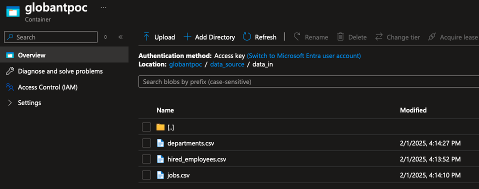  
ADLS path where the initial files to be loaded are located.

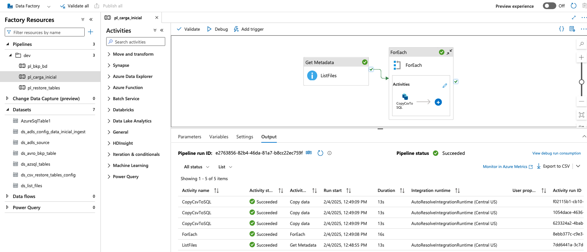  
Data Factory Pipeline where the initial load takes place.

  
Data Factory Pipeline with 3 activities.

---

2. SQL Tables Backup Process:

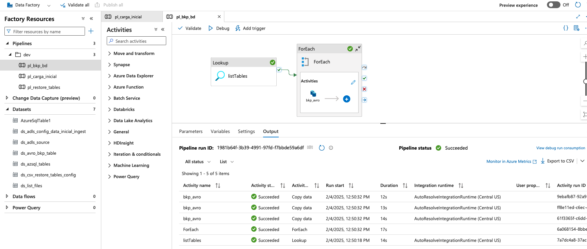  
Data Factory Pipeline with 3 activities.

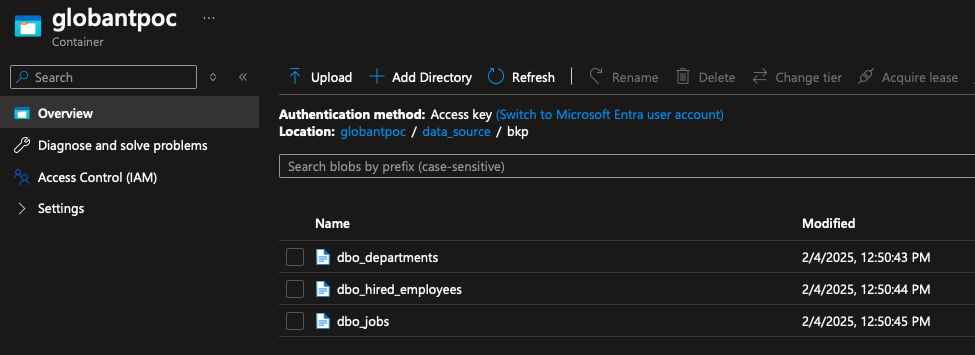  
ADLS path where the backups of the tables in AVRO format are stored.

---

3. SQL Tables Restore Process:

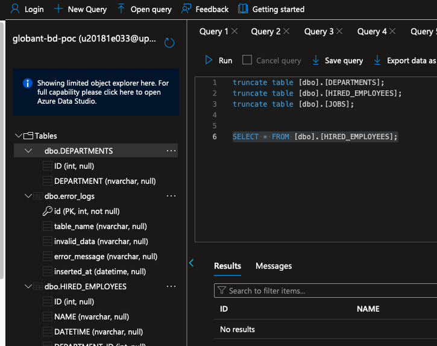  
Truncating tables to perform the restore.

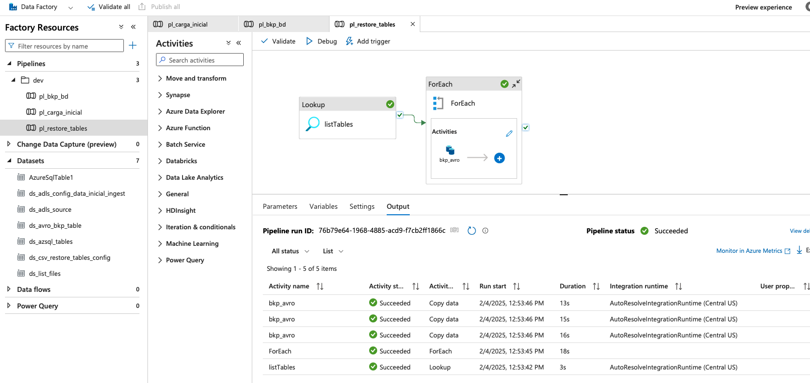  
Data Factory Pipeline with 3 activities.

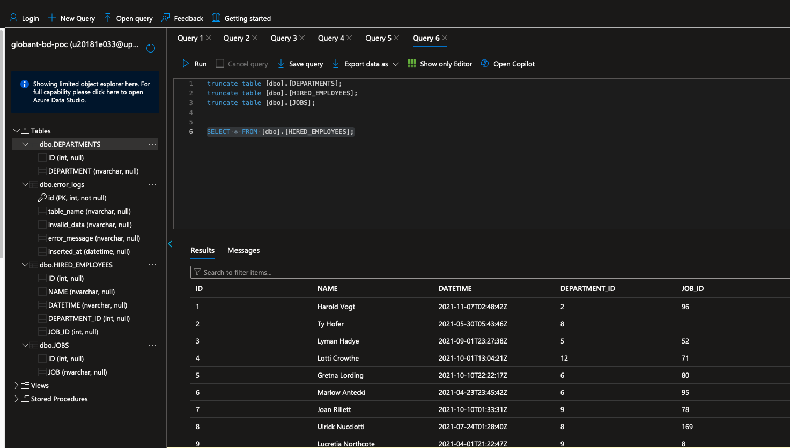  
Tables loaded with the `pipeline_restore_tables` process.

---

4. API Data Insertion:

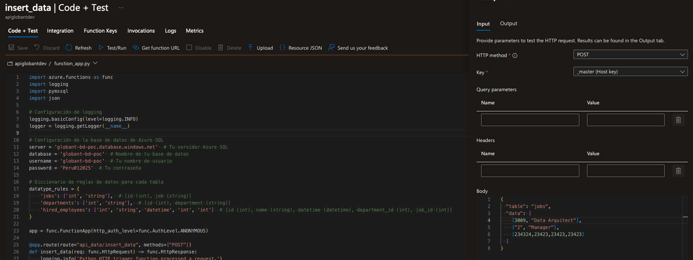  
Input data for the API.

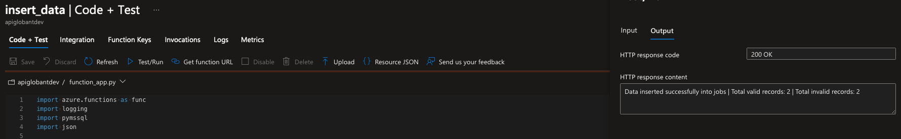  
API Output.

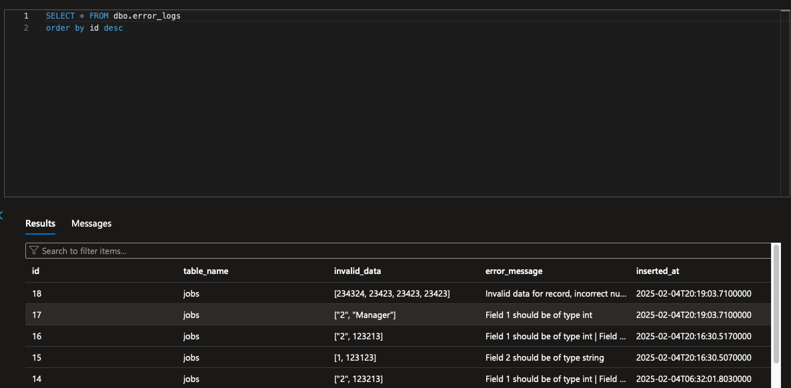  
Log of records not inserted.

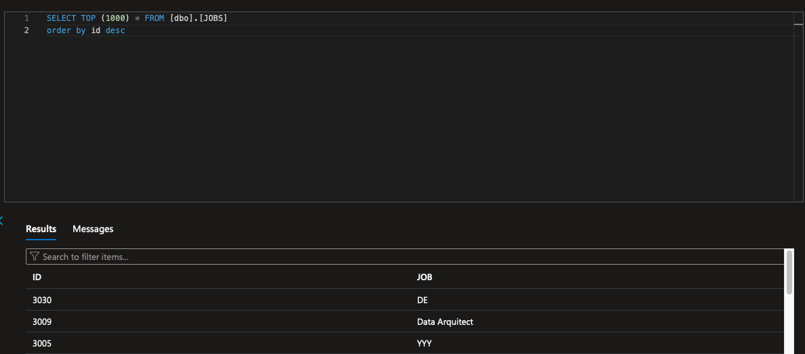  
Validated record inserted.

---

5. API Data Retrieval:

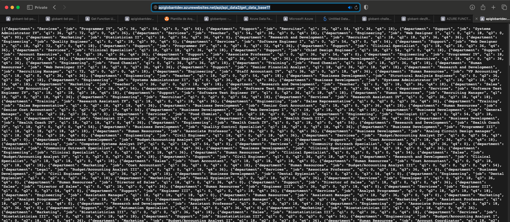  
First request for Challenge 2.

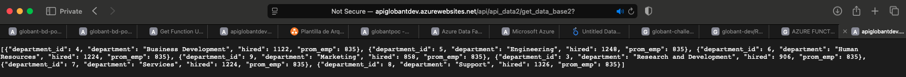  
Second request for Challenge 2.

## Azure App Services for API Solution

App Services are used to mount the `function_app.py` script:
  - `function_app.py` runs the API and connects to Azure Synapse using pyodbc to ingest records.

## 📋 **Installation and Setup**

### Clone the Repository

```bash
git clone https://github.com/marioych/globant-dev.git
cd globant-dev